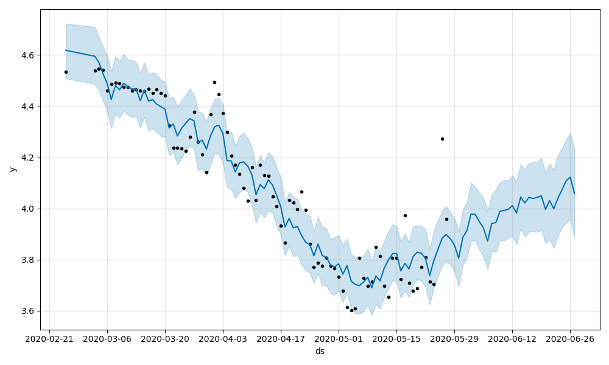
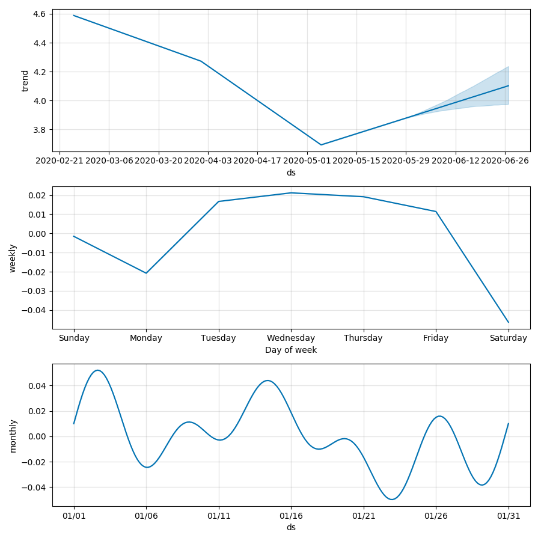

# Playing the Auction House: Making money in World of Warcraft

## Introduction
World of Warcraft(WoW) is a massive multiplayer online role playing game (MMORG) released by Blizzard Entertainment in 2004.

Players can buy and sell certain goods found in the game on the auction house using a virtual currency.

This project seeks to find a systematic approach to finding items to buy and sell on the auction house to make a profit.

## The Data
Data is taken from the Undermine Journal Newswire database, which is sourced from the official Blizzard API, and then inserted into a postgreSQL database.

The data contains roughly 5500 unique items that were listed on the auction house on the realm Area-52 from February through May.

For the time series forecast, we pick one item to look at, and then model using the average price at each date.

## Example for item 'Coarse Leather' using FB Prophet

## Narrowing the Scope

1. Ordered the unique items by the largest average quantity.

2. Determined positive or negative trend. 

3. Found the top items with a positive trend.

4. Calculate profit as: sell price - buy price 

## Multi-Armed Bandit Problem

The multi-armed bandit is a problem characterized by a limited amount of resources that must be allocated to competing choices to maximize gain.

### Using Random Selection

| Item               | Selected Frequency |
|--------------------|--------------------|
| Silk Cloth         | 18%                |
| Netherweave Cloth  | 15%                |
| Roseate Pigment    | 12%                |
| Sumptuous Fur      | 12%                |
| Coarse Leather     | 12%                |
| Frenzied Fangtooth | 9%                 |
| Deep Sea Satin     | 9%                 |
| Shal'dorei Silk    | 6%                 |
| Cragscale          | 3%                 |
| Blood-Stained Bone | 3%                 |

Expected Profit: -1,242

### Using Upper Confidence Bound algorithm (UCB1)

| Item               | Selected Frequency |
|--------------------|--------------------|
| Frenzied Fangtooth | 19%                |
| Sumptuous Fur      | 19%                |
| Deep Sea Satin     | 16%                |
| Silk Cloth         | 10%                |
| Cragscale          | 10%                |
| Blood-Stained Bone | 10%                |
| Shal'dorei Silk    | 6%                 |
| Netherweave Cloth  | 3%                 |
| Roseate Pigment    | 3%                 |
| Coarse Leather     | 3%                 |

Expected Profit: 475

## Conclusion and Next Steps

Given the results, we can see the UCB1 algorithm has favorites that leads to higher profit, and further narrows down the choice of items to buy and sell.

Incorporating inter-day data would be important in determining at what time of day to buy and sell, and finding any arbitrage opportunities. 

Data mine events that could change trend direction.
